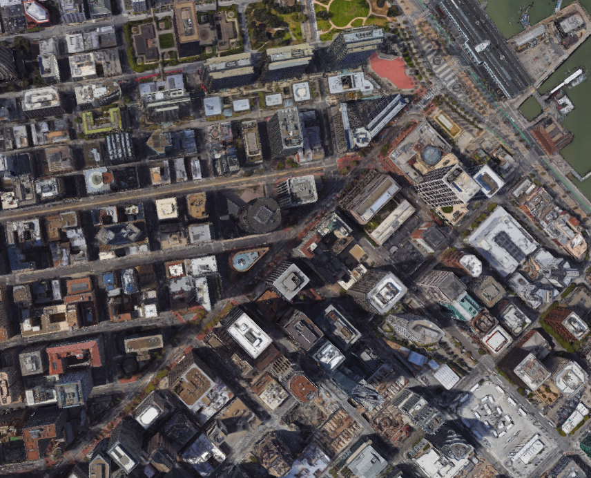

## Project: 3D Motion Planning

---

# Required Steps for a Passing Submission:
1. Load the 2.5D map in the colliders.csv file describing the environment.
2. Discretize the environment into a grid or graph representation.
3. Define the start and goal locations.
4. Perform a search using A* or other search algorithm.
5. Use a collinearity test or ray tracing method (like Bresenham) to remove unnecessary waypoints.
6. Return waypoints in local ECEF coordinates (format for `self.all_waypoints` is [N, E, altitude, heading], where the drone’s start location corresponds to [0, 0, 0, 0].
7. Write it up.
8. Congratulations!  Your Done!

## [Rubric](https://review.udacity.com/#!/rubrics/1534/view) Points
### Here I will consider the rubric points individually and describe how I addressed each point in my implementation.  

---
### Writeup / README

#### 1. Provide a Writeup / README that includes all the rubric points and how you addressed each one.  You can submit your writeup as markdown or pdf.  

You're reading it! Below I describe how I addressed each rubric point and where in my code each point is handled.

### Explain the Starter Code

#### 1. Explain the functionality of what's provided in `motion_planning.py` and `planning_utils.py`
These scripts contain a basic planning implementation that includes...

##### planning_utils.py : I reused most of the helper functions that were implemented during the excercies. Made few modifications to customize them for the project.

create_grid() : Accepts obstacle data, altitude & safety distance. It returns a grid representation of a 2D configuration space. Customized this function to return north_offset and east_offsets (grid centers)

Action class : An action is represented by a 3 element tuple. The first 2 values are the delta of the action relative
 to the current grid position. The third and final value is the cost of performing the action. Most of the code is from the class exercises. Customized this class to include a change in diagonal direction (delta in Norht East, North West, South East, South West)

valid_actions(): Returns a list of valid actions given a grid and current node. Code from exercise, but customized to include Norht East, North West, South East, South West

a_star() : A grid based implementation of A* search which returns a path from a given start point to a goal destination

heuristic() : Calculates the Euclidean distance between a given point and the goal. The heuristic is used as an approximation to guide A* search and make it more efficient to return a path

point() :  Returns a 3D point as a numpy array

collinearity_check():  Returns True if 3 points are collinear within the threshold set by Epsilon (float implementation)

prune_path() :  Prunes the path returned by A* search. It uses collinearity_check() to remove unecessary waypoints

bres_prune() : Uses Bresenham ray tracing instead of collinearity to prune the path of unecessary waypoints

##### motion_planning.py : Implements motion planning using basic grid search. Uses helper functions from planning_utils.py. It plans the motion based on grid start, grid goal, drone altitude and drone safe distance.

Most of the states and call back registrations are based on logic from the backyard fyler project.

States Class : contains states a drone can be set to (manual, arming,takeoff, landing etc)

Motion Planning Class : Accepts udacity drone. 

Several call backs and transition functions are implemented to help update the drones position, velocity and in transitioning between states.

Once the dron is initialized then plan_path() helps plan the path.

And here's a lovely image of my results (ok this image has nothing to do with it, but it's a nice example of how to include images in your writeup!)

Here's | A | Snappy | Table
--- | --- | --- | ---
1 | `highlight` | **bold** | 7.41
2 | a | b | c
3 | *italic* | text | 403
4 | 2 | 3 | abcd

### Implementing Your Path Planning Algorithm

#### 1. Set your global home position
Here students should read the first line of the csv file, extract lat0 and lon0 as floating point values and use the self.set_home_position() method to set global home. Explain briefly how you accomplished this in your code.

The global starting location is read in from the colliders.csv file as a latitude (lat), longitude (lon) coordinate pair

            with open('colliders.csv', newline='') as f:
                r = csv.reader(f)
                r1 = next(r)
            f.close()
            
            lat0 = float((r1[0].strip('lat0')))      
            lon0 = float((r1[1].strip(' lon0')))

            # TODO: set home position to (lon0, lat0, 0)
            self.set_home_position(lon0, lat0, 0.0)

And here is a lovely picture of our downtown San Francisco environment from above!

#### 2. Set your current local position
Here as long as you successfully determine your local position relative to global home you'll be all set. Explain briefly how you accomplished this in your code.

First retrieve current global position 
global_position = [self._longitude, self._latitude, self._altitude]

Convert to local position using the global to local function
local_position = global_to_local(global_position, self.global_home)

Meanwhile, here's a picture of me flying through the trees!

#### 3. Set grid start position from local position
This is another step in adding flexibility to the start location. As long as it works you're good to go!

After passing the obstacles data to create_grid(), i recieved the north_offet and east_offsets

Converted start position to current position rather than map center recieved from create_grid()
grid_start = (int(np.ceil(local_position[0] - north_offset)),
                          int(np.ceil(local_position[1] - east_offset)))

#### 4. Set grid goal position from geodetic coords
This step is to add flexibility to the desired goal location. Should be able to choose any (lat, lon) within the map and have it rendered to a goal location on the grid.

Chose 799,295 as goal by adjusting the north and east offsets
grid_goal = (-north_offset + 483, -east_offset -150)

#### 5. Modify A* to include diagonal motion (or replace A* altogether)
Minimal requirement here is to modify the code in planning_utils() to update the A* implementation to include diagonal motions on the grid that have a cost of sqrt(2), but more creative solutions are welcome. Explain the code you used to accomplish this step.

A* implementation from class exercises was used. However, to customize for diagonal motion, the Action class was modified to include north_west, north_east, south_west, south_east directions

    NORTH_WEST = (-1, -1, np.sqrt(2))
    NORTH_EAST = (-1, 1, np.sqrt(2))
    SOUTH_WEST = (1, -1, np.sqrt(2))
    SOUTH_EAST = (1, 1, np.sqrt(2))
    
valid_actions() was also modified accordingly
if (x - 1 < 0 or y - 1 < 0) or grid[x - 1, y - 1] == 1:
        valid_actions.remove(Action.NORTH_WEST)
    if (x - 1 < 0 or y + 1 > m) or grid[x - 1, y + 1] == 1:
        valid_actions.remove(Action.NORTH_EAST)
    if (x + 1 > n or y - 1 < 0) or grid[x + 1, y - 1] == 1:
        valid_actions.remove(Action.SOUTH_WEST)
    if (x + 1 > n or y + 1 > m) or grid[x + 1, y + 1] == 1:
        valid_actions.remove(Action.SOUTH_EAST)
 

#### 6. Cull waypoints 
For this step you can use a collinearity test or ray tracing method like Bresenham. The idea is simply to prune your path of unnecessary waypoints. Explain the code you used to accomplish this step.

Initially collinearity_check() was used to prune the path returned by a_star().
Once i updated to Bresenham, the number of way points drastically reduced.

###### Replacing collinearity with Bresenham !
    def bres_prune(grid, path):
    """
    Use the Bresenham module to trim uneeded waypoints from pruned path
    """
    pruned_path = [p for p in path]
    i = 0
    while i < len(pruned_path) - 2:
        p1 = pruned_path[i]
        p2 = pruned_path[i + 1]
        p3 = pruned_path[i + 2]
        # if the line between p1 and p2 doesn't hit an obstacle
        # remove the 2nd point.
        # The 3rd point now becomes the 2nd point
        # and the check is redone with a new third point
        # on the next iteration.
        if  all((grid[pp] == 0) for pp in bresenham(int(p1[0]), int(p1[1]), int(p3[0]), int(p3[1]))):
            # Something subtle here but we can mutate
            # `pruned_path` freely because the length
            # of the list is checked on every iteration.
            pruned_path.remove(p2)

        else:
            i += 1
    return pruned_path
  

### Execute the flight
#### 1. Does it work?
It works!

### Double check that you've met specifications for each of the [rubric](https://review.udacity.com/#!/rubrics/1534/view) points.
  
# Extra Challenges: Real World Planning

For an extra challenge, consider implementing some of the techniques described in the "Real World Planning" lesson. You could try implementing a vehicle model to take dynamic constraints into account, or implement a replanning method to invoke if you get off course or encounter unexpected obstacles.

